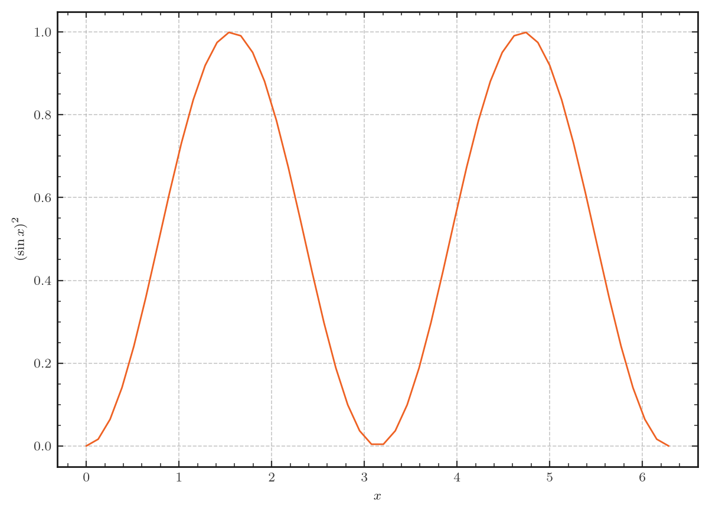

Luxe -- the easiest stylefile around
====================================

:code:`luxe` is the name of the default stylefile that Khriss ships with.
It sets up most parameters you need for an aesthetic figure, but these
options can be overrided.

Usage
-----

.. code-block:: python

    import matplotlib.pyplot as plt
    import khriss

    plt.style.use('khriss.luxe')

That's it! Below is an example of a :code:`luxe` figure, generated with the
below code. The only other packages used were :code:`fonts-cmu` and :code:`texlive`.

.. code-block:: python

    import matplotlib.pyplot as plt
    import khriss
    import numpy as np

    plt.style.use('khriss.luxe')

    x = np.linspace(0, 2*np.pi)
    y = np.sin(x)**2

    plt.plot(x, y)
    plt.xlabel(r"$x$")
    plt.ylabel(r"$\left(\sin x\right)^2$")
    plt.savefig('example_figure.png')

